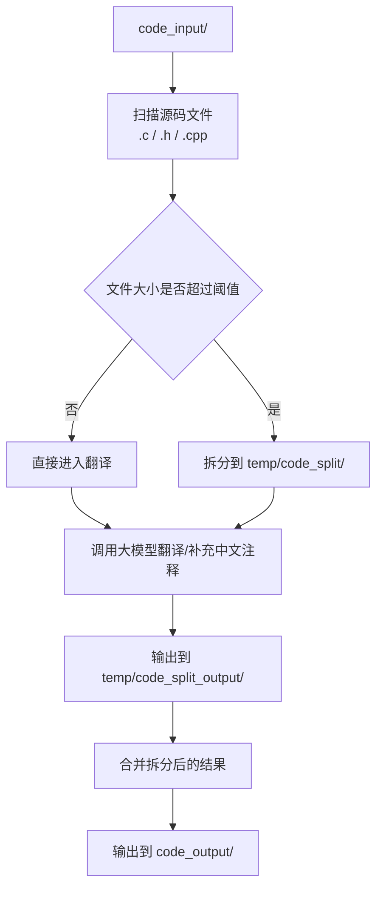
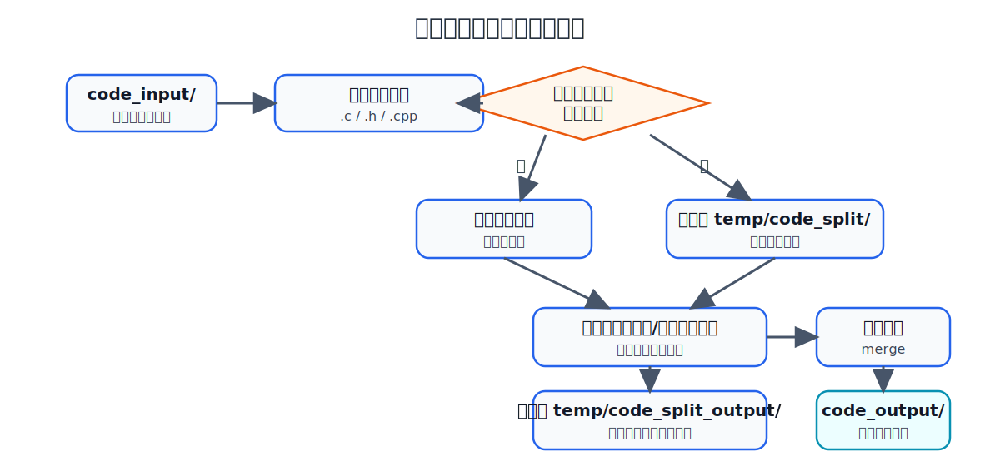

# 代码注释转中文

一个用于批量处理 STM32 HAL/LL 源码注释的 Python 工具。

它会按下面的流程工作：

1. 扫描 `code_input/` 中的 `.c`、`.h`、`.cpp` 文件
2. 对大文件按安全边界拆分到 `temp/code_split/`
3. 调用大模型把英文注释翻译/补充为中文，输出到 `temp/code_split_output/`
4. 将拆分文件重新合并到 `code_output/`

项目当前主要面向 STM32 HAL 库源码注释中文化，提示词也默认按“嵌入式初学者可读”来生成注释。

## 处理流程图



如果当前 Markdown 阅读器不支持 Mermaid，可查看下面这张图片：



## 目录说明

- `main.py`：主入口，串联拆分、翻译、合并流程
- `translate_comments.py`：调用大模型翻译注释
- `split_c_file.py`：按空行/安全边界拆分大文件
- `merge_split_output.py`：合并拆分后的翻译结果
- `config.json`：运行配置
- `system_prompt.txt`：模型系统提示词
- `code_input/`：待处理源码输入目录
- `temp/code_split/`：拆分后的临时文件
- `temp/code_split_output/`：拆分文件翻译结果
- `code_output/`：最终输出目录
- `run.bat`：运行主流程
- `merge.bat`：仅执行合并
- `clean_temp.bat`：清理 `temp/code_split/` 和 `temp/code_split_output/` 中的临时文件

## 环境要求

- Python 3.10+
- 依赖：

```bash
pip install openai tqdm
```

## 配置说明

编辑 `config.json` 来控制模型调用、输入输出目录和拆分参数。

当前配置示例：

```json
{
  "api_key_env": "OPENAI_KEY",
  "base_url": "https://modelservice.jdcloud.com/coding/openai/v1",
  "model": "GLM-5",
  "temperature": 0.2,
  "top_p": 1,
  "timeout": 700,
  "max_workers": 3,
  "input_dir": "code_input",
  "output_dir": "code_output",
  "split_dir": "temp/code_split",
  "split_output_dir": "temp/code_split_output",
  "system_prompt_path": "system_prompt.txt",
  "file_extensions": [".c", ".h", ".cpp"],
  "Large_file_split_threshold": 20000,
  "split_max_token": 20000,
  "split_min_token": 10000,
  "encoding": "utf-8"
}
```

### 字段说明

- `api_key_env`
  
  - 含义：API Key 所在的环境变量名称。
  - 作用：程序启动时会读取这个环境变量，并用它初始化模型客户端。
  - 当前值：`OPENAI_KEY`

- `base_url`
  
  - 含义：模型服务接口地址。
  - 作用：当你使用代理平台、第三方兼容 OpenAI 的服务，或者私有中转服务时，需要填写这里。
  - 当前值：`https://modelservice.jdcloud.com/coding/openai/v1`

- `model`
  
  - 含义：调用的模型名称。
  - 作用：决定翻译/补充注释时实际使用哪个模型。
  - 当前值：`GLM-5`

- `temperature`
  
  - 含义：采样温度。
  - 作用：值越低，输出通常越稳定；值越高，输出通常越发散。
  - 建议：注释翻译这类任务通常设置为 `0` 到 `0.3` 更稳。
  - 当前值：`0.2`

- `top_p`
  
  - 含义：核采样参数。
  - 作用：控制候选词采样范围，通常与 `temperature` 配合使用。
  - 建议：一般保持 `1` 即可。
  - 当前值：`1`

- `timeout`
  
  - 含义：单次请求超时时间。
  - 作用：避免模型响应过慢时一直卡住。
  - 单位：秒。
  - 当前值：`700`

- `max_workers`
  
  - 含义：并发处理文件数量。
  - 作用：翻译阶段会使用线程池并发调用模型接口。
  - 建议：根据接口限速和机器性能调整，过大可能触发限流。
  - 当前值：`3`

- `input_dir`
  
  - 含义：输入目录。
  - 作用：放置待处理的源代码文件，程序会递归扫描该目录。
  - 当前值：`code_input`

- `output_dir`
  
  - 含义：最终输出目录。
  - 作用：合并后的最终代码会写入这里。
  - 当前值：`code_output`

- `split_dir`
  
  - 含义：拆分后的临时文件目录。
  - 作用：大文件在调用模型前会先拆分，拆分结果保存到这里。
  - 当前值：`temp/code_split`

- `split_output_dir`
  
  - 含义：拆分文件翻译后的临时输出目录。
  - 作用：模型处理后的每个分片结果先写入这里，最后再统一合并。
  - 当前值：`temp/code_split_output`

- `system_prompt_path`
  
  - 含义：系统提示词文件路径。
  - 作用：控制模型如何翻译和补充注释。
  - 当前值：`system_prompt.txt`

- `file_extensions`
  
  - 含义：要处理的文件扩展名列表。
  - 作用：只有后缀匹配的文件才会被扫描和处理。
  - 当前值：`.c`、`.h`、`.cpp`

- `Large_file_split_threshold`
  
  - 含义：大文件拆分阈值。
  - 作用：当文件大小超过该值时，程序会先拆分，再分片送给模型处理；小于该值则直接处理。
  - 单位：字节。
  - 当前值：`20000`

- `split_max_token`
  
  - 含义：单个分片的最大尺寸限制。
  - 作用：拆分时尽量让每个片段不要超过这个值。
  - 说明：代码里实际按编码后的字节大小控制，不是严格意义上的大模型 token 数。
  - 当前值：`20000`

- `split_min_token`
  
  - 含义：最后一个分片的最小尺寸限制。
  - 作用：避免最后一个分片过小；如果最后一段太小，程序会尝试减少一次拆分。
  - 说明：同样是按字节大小近似控制。
  - 当前值：`10000`

- `encoding`
  
  - 含义：读取和写入源文件时使用的编码。
  - 作用：用于拆分、翻译和保存文件。
  - 建议：常见情况下使用 `utf-8`，如果源码不是 UTF-8，需要改成对应编码。
  - 当前值：`utf-8`

### 配置建议

- 如果模型接口兼容 OpenAI API，一般只需要正确设置：
  
  - `api_key_env`
  - `base_url`
  - `model`

- 如果处理的源码很多，或者单个文件较大，建议关注：
  
  - `max_workers`
  - `Large_file_split_threshold`
  - `split_max_token`
  - `split_min_token`

- 如果遇到乱码、解码失败，优先检查：
  
  - `encoding`

## 使用方法

### 1. 设置 API Key

当前配置默认读取环境变量 `OPENAI_KEY`：

```bash
export OPENAI_KEY="your_api_key"
```

Windows CMD：

```cmd
set OPENAI_KEY=your_api_key
```

PowerShell：

```powershell
$env:OPENAI_KEY="your_api_key"
```

### 2. 放入待处理源码

将需要处理的源码放到 `code_input/` 目录下，保留原有目录结构即可。

### 3. 执行

直接运行：

```bash
python main.py
```

或双击：

- `run.bat`：执行完整流程
- `merge.bat`：只执行合并
- `clean_temp.bat`：清理临时拆分文件和临时翻译结果

## 输出结果

- 最终结果位于 `code_output/`
- 拆分与中间结果位于 `temp/`
- 拆分日志会写到源文件所在目录下的 `log/时间戳/`

## 清理临时文件

如果需要清空临时拆分文件和临时翻译结果，可以运行：

- `clean_temp.bat`

它会清理以下两个目录中的内容，但会保留目录本身：

- `temp/code_split/`
- `temp/code_split_output/`

## 注意事项

- 该工具依赖大模型输出质量，建议先小批量测试再批量处理
- `system_prompt.txt` 当前要求**只修改/补充注释，不改动代码本身**
- 大文件会被拆分处理，避免一次请求过长
- 若模型返回了代码块，程序会自动提取 ```c ``` 中的内容保存

## 适用场景

- STM32 HAL/LL 库英文注释转中文
- 给初学者补充更详细的寄存器、宏、结构体、函数说明
- 批量整理教学用嵌入式源码

## 自定义

本项目将各个阶段分开成不同脚本处理，如果你对某个阶段有更好的处理方法，直接将写好的模块替换对应的文件即可
